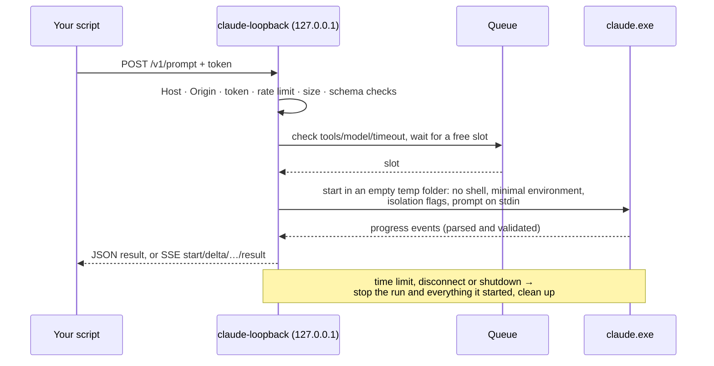

# claude-loopback

Call **Claude Code** from your own scripts over plain HTTP. claude-loopback is a small local
server: send it a prompt, it runs the prompt through your logged-in Claude Code CLI in headless
mode (`claude -p`), and returns the answer as JSON or streams it as server-sent events.

```
your script ──HTTP──▶ claude-loopback (127.0.0.1) ──▶ claude -p ──▶ your Claude subscription
```

- **Local only:** it listens on `127.0.0.1` and needs a secret token for every request that does
  work.
- **Safe defaults:** Claude's tools are off, your Claude Code settings and plugins aren't loaded,
  and each run happens in an empty temporary folder.
- **Uses your existing Claude Code login**, so there are no API keys to manage.

> **Personal use only.** claude-loopback drives *your own* Claude Code login for *your own*
> scripts, on your own machine. Don't expose it to other people or use it to give anyone else
> access to Claude. That is likely outside Anthropic's terms for consumer plans. Check the terms
> for your plan. (This is not legal advice.)

## Requirements

- **Windows 10 or 11.** Windows is the only supported platform for now.
- **[Node.js](https://nodejs.org) 24 or newer.**
- **[Claude Code](https://claude.com/claude-code) 2.1.259 or newer**, logged in. Run `claude`
  once and type `/login`.

## Install

```powershell
npm install -g claude-loopback
claude-loopback setup     # creates your settings with a secret token and checks your machine
```

`claude-loopback setup` should end with `Ready.`. If it lists something to fix, fix it and run it
again. (You can skip it: the first `claude-loopback` run creates the settings too. Setup just
tells you up front if anything is missing.)

Don't want to install anything? `npx claude-loopback` runs the latest version directly.

Your settings and token live in a file only your Windows account can read:
`%APPDATA%\claude-loopback\config.env` (`claude-loopback config` prints the exact path). Keep the
token private: anyone who has it can use your Claude subscription through the server.

## Run

```powershell
claude-loopback
```

It prints a short summary (the API address, your Claude Code version and login, and the allowed
models), then one colored line per request. It keeps running: leave that window open while you
use it.

- **Stop:** press **Ctrl+C**. Running prompts get up to 10 seconds to finish. Press Ctrl+C again
  to stop immediately.
- **Port:** it listens on `http://127.0.0.1:7337` by default. Change that with `LOOPBACK_PORT` in
  your settings file.

| Command | What it does |
|---|---|
| `claude-loopback` | Start the server (same as `claude-loopback start`) |
| `claude-loopback setup` | Create your settings if needed and check Node, Claude Code and its login |
| `claude-loopback token` | Print your token, for your scripts |
| `claude-loopback config` | Print where your settings file is |
| `claude-loopback --version` | Print the version |

## Check it's working

In a second PowerShell window:

```powershell
# Load your token (don't type or paste it: shell history keeps what you type)
$env:LOOPBACK_TOKEN = (claude-loopback token)

curl.exe http://127.0.0.1:7337/health
curl.exe http://127.0.0.1:7337/ready -H "Authorization: Bearer $env:LOOPBACK_TOKEN"
curl.exe http://127.0.0.1:7337/v1/prompt `
  -H "Authorization: Bearer $env:LOOPBACK_TOKEN" -H "Content-Type: application/json" `
  -d '{"prompt": "Reply with exactly the word: pong"}'
```

What to expect:
- `/health` returns `{"status":"ok"}`.
- `/ready` returns `"ready":true`.
- The last command returns JSON with `"text":"pong"`.

The `curl` examples need PowerShell 7.3 or newer. Always use `127.0.0.1`, not `localhost`:
Windows may resolve `localhost` to `::1`, where the server isn't listening.

## The API

| Route | Token? | What it does |
|---|---|---|
| `GET /health` | no | The server is running |
| `GET /openapi.json` | no | The full API description (OpenAPI 3.1) |
| `GET /ready` | yes | Claude Code found, supported and logged in; queue counters |
| `POST /v1/prompt` | yes | Run a prompt and return the whole answer as JSON |
| `POST /v1/prompt/stream` | yes | Run a prompt and stream the answer as server-sent events |

Send the token as `Authorization: Bearer <token>`, and request bodies as
`Content-Type: application/json`.

### Viewing the full API docs

The complete, always-current description is [`docs/openapi.json`](docs/openapi.json). It is
generated from the same schemas the server validates requests with, and it is also served at
`GET /openapi.json`. To browse it:

- **VS Code:** install an OpenAPI/Swagger viewer extension, open `docs/openapi.json`, and use its
  preview.
- **Browser:** open [editor.swagger.io](https://editor.swagger.io), then File → Import file →
  `docs/openapi.json`. The file contains no secrets.
- **Static page:** run `npx @redocly/cli build-docs docs/openapi.json -o api.html`, then open
  `api.html`.

### Request body (both prompt routes)

| Field | Type | Notes |
|---|---|---|
| `prompt` | string | **Required**, up to 200 000 characters. |
| `attachments` | `[{ "name", "content" }]` | Up to 20 text files, 2 MB total. Put ahead of the prompt, so Claude can read them without tools. |
| `model` | string | One of `LOOPBACK_ALLOWED_MODELS`. Default `LOOPBACK_DEFAULT_MODEL`. |
| `systemPrompt` | string | Added to Claude Code's system prompt. Up to 16 KB. |
| `effort` | `low` · `medium` · `high` · `xhigh` · `max` | How hard Claude thinks; `low` is fastest. |
| `jsonSchema` | object | Ask for structured output matching this JSON Schema. The answer arrives in `structuredOutput`. |
| `tools` | string[] | Claude Code tools to enable for this run. Only names in `LOOPBACK_ALLOWED_TOOLS` (none by default). |
| `timeoutMs` | integer | 1000 up to `LOOPBACK_MAX_TIMEOUT_MS`. Default `LOOPBACK_DEFAULT_TIMEOUT_MS`. |

Unknown fields are rejected. A request can only *narrow* what the server allows: it can never
turn on a tool, model or timeout that the server's settings don't.

### Response

```json
{
  "id": "6b1c2f0e-…",
  "text": "pong",
  "model": "claude-sonnet-5-5",
  "stopReason": "end_turn",
  "durationMs": 1467,
  "queueMs": 0,
  "usage": { "inputTokens": 3646, "outputTokens": 72, "cacheReadTokens": 0, "cacheCreationTokens": 0 },
  "costUsd": 0.004
}
```

- **`structuredOutput`:** present when you sent a `jsonSchema`.
- **`costUsd`:** Claude Code's own estimate.
- **`queueMs`:** how long the request waited for a free slot.

### Streaming

`POST /v1/prompt/stream` takes the same body and answers with `text/event-stream`:

| Event | Data |
|---|---|
| `start` | `{ "model" }` |
| `delta` | `{ "text" }`: the next piece of the answer |
| `retry` | `{ "attempt", "maxRetries", "delayMs", "error" }`: Claude Code is retrying an API error |
| `result` | the same JSON as `POST /v1/prompt`; always the last event on success |
| `error` | `{ "code", "message", "requestId" }`; always the last event on failure |

`: ping` comments arrive every 15 seconds to keep the connection alive. Problems found before the
run starts (a bad request, a full queue, …) come back as a normal JSON error with a real HTTP
status instead of a stream.

### Errors

Every error looks like `{ "error": { "code", "message", "requestId" } }`.

| Status | Codes | Usually means |
|---|---|---|
| 400 | `invalid_request`, `tool_not_allowed`, `model_not_allowed` | Fix the request body |
| 401 | `unauthorized` | Missing or wrong token |
| 403 | `forbidden_host`, `forbidden_origin` | Use `127.0.0.1`; browsers are blocked by default |
| 413 / 415 | `payload_too_large`, `unsupported_media_type` | Body too big, or not JSON |
| 429 | `queue_full`, `rate_limited`, `usage_limit` | Slow down; respect `Retry-After` |
| 502 | `cli_failed`, `cli_protocol_error`, `output_too_large`, `cli_incompatible` | Claude Code failed or misbehaved |
| 503 | `cli_unavailable`, `cli_not_authenticated`, `queue_timeout`, `shutting_down` | Claude Code missing or logged out, or the server is busy or stopping |
| 504 | `timeout` | The run took longer than `timeoutMs` |

### Examples

**TypeScript (Node 18+):**

```ts
const base = "http://127.0.0.1:7337";
const headers = {
  authorization: `Bearer ${process.env.LOOPBACK_TOKEN}`,
  "content-type": "application/json",
};

const response = await fetch(`${base}/v1/prompt`, {
  method: "POST",
  headers,
  body: JSON.stringify({
    prompt: "Summarise these notes in three bullet points.",
    attachments: [{ name: "notes.md", content: "…your notes…" }],
  }),
});
const body = await response.json();
if (!response.ok) throw new Error(`${body.error.code}: ${body.error.message}`);
console.log(body.text);
```

**Streaming in TypeScript:**

```ts
const stream = await fetch(`${base}/v1/prompt/stream`, {
  method: "POST",
  headers,
  body: JSON.stringify({ prompt: "Write a haiku about pipes." }),
});
const decoder = new TextDecoder();
let buffer = "";
for await (const chunk of stream.body!) {
  buffer += decoder.decode(chunk, { stream: true });
  let end: number;
  while ((end = buffer.indexOf("\n\n")) !== -1) {
    const block = buffer.slice(0, end);
    buffer = buffer.slice(end + 2);
    const event = /^event: (.*)$/m.exec(block)?.[1];
    const data = /^data: (.*)$/m.exec(block)?.[1];
    if (event === "delta" && data) process.stdout.write(JSON.parse(data).text);
  }
}
```

**Python (`requests`):**

```python
import os, requests

response = requests.post(
    "http://127.0.0.1:7337/v1/prompt",
    headers={"Authorization": f"Bearer {os.environ['LOOPBACK_TOKEN']}"},
    json={
        "prompt": "What is the capital of France?",
        "jsonSchema": {"type": "object", "properties": {"answer": {"type": "string"}}, "required": ["answer"]},
    },
    timeout=300,
)
response.raise_for_status()
print(response.json()["structuredOutput"]["answer"])
```

## Configuration

Settings live in your settings file: run `claude-loopback config` to see where, then edit it in
any text editor and restart the server. It lists every setting with its default. Environment
variables with the same names take precedence over the file. A wrong or misspelled `LOOPBACK_*`
setting stops the server with a clear message.

| Setting | Default | What it controls |
|---|---|---|
| `LOOPBACK_TOKEN` | *(set by setup)* | **Required.** The secret every request must send (at least 43 random characters). |
| `LOOPBACK_PORT` | `7337` | Port on `127.0.0.1`. |
| `LOOPBACK_CLAUDE_PATH` | found on PATH | Full path to `claude.exe`, if it isn't on PATH. |
| `LOOPBACK_MAX_CONCURRENCY` | `2` | Prompts running at the same time. |
| `LOOPBACK_QUEUE_SIZE` | `10` | Prompts that may wait for a free slot. |
| `LOOPBACK_QUEUE_TIMEOUT_MS` | `60000` | Longest wait for a slot. |
| `LOOPBACK_DEFAULT_TIMEOUT_MS` | `120000` | Time limit per prompt when the request sets none. |
| `LOOPBACK_MAX_TIMEOUT_MS` | `600000` | Largest `timeoutMs` a request may ask for. |
| `LOOPBACK_ALLOWED_TOOLS` | *(none)* | Claude Code tools requests may enable, e.g. `WebSearch,WebFetch`. |
| `LOOPBACK_ALLOWED_MODELS` | `sonnet,opus,haiku,fable` | Models requests may choose. |
| `LOOPBACK_DEFAULT_MODEL` | first allowed | Model used when a request doesn't choose one. |
| `LOOPBACK_MAX_BODY_BYTES` | `4194304` | Largest request body (max 8 MiB). |
| `LOOPBACK_RATE_LIMIT_PER_MIN` | `30` | Requests per minute. |
| `LOOPBACK_STREAM_STALL_MS` | `30000` | Drop a streaming client that stops reading for this long. |
| `LOOPBACK_CORS_ORIGINS` | *(none)* | Browser origins allowed to call the API (e.g. `http://127.0.0.1:3000`). |
| `LOOPBACK_LOG_LEVEL` | `info` | `fatal`, `error`, `warn`, `info`, `debug`, `trace` or `silent`. |
| `LOOPBACK_LOG_FORMAT` | `auto` | `pretty` (readable, colored lines), `json` (one JSON object per line), or `auto`: pretty in a terminal, JSON when output goes to a file or another program. |
| `LOOPBACK_LOG_PROMPTS` | `false` | Also log prompt and answer text. For local debugging only. |

The address is always `127.0.0.1`. There is deliberately no setting to expose the server on your
network.

## Updating

```powershell
npm install -g claude-loopback@latest
```

Then restart `claude-loopback`. Your settings and token are kept. If you update Claude Code itself,
run `claude-loopback setup` again to re-check it.

To uninstall: `npm uninstall -g claude-loopback`, then delete the folder that
`claude-loopback config` showed.

## Troubleshooting

| You see | Fix |
|---|---|
| `'claude-loopback' is not recognized` | Open a new terminal after installing. If it persists, check that the folder `npm prefix -g` prints is on your PATH. |
| `npm error EBADPLATFORM` | Only Windows is supported for now. |
| `claude.exe was not found on PATH` | Install Claude Code, or set `LOOPBACK_CLAUDE_PATH` in your settings file. |
| `Only a claude.cmd/.bat shim is on PATH` | Set `LOOPBACK_CLAUDE_PATH` to the real `claude.exe`. |
| `Claude CLI … is older than the minimum supported 2.1.259` | Run `claude update`. |
| `Claude CLI could not be run` | Reinstall Claude Code, or check `LOOPBACK_CLAUDE_PATH`. |
| `Another claude-loopback instance is already running` | It's already running in another window; use that one or stop it. |
| `cannot listen on 127.0.0.1:7337` | Something else uses that port: set another `LOOPBACK_PORT`. |
| `/ready` says *not logged in* | Run `claude`, type `/login`. |
| `401 unauthorized` | Your script's token doesn't match: reload it with `claude-loopback token`. |
| `403 forbidden_host` | Use `http://127.0.0.1:…`, not a hostname. |
| `429 usage_limit` | Your Claude usage limit is reached. Wait for `Retry-After` seconds. |

## Security

What claude-loopback protects against:
- **Other machines:** it only ever listens on `127.0.0.1`.
- **Websites in your browser:**
  - The `Host` header is checked, which defeats DNS-rebinding attacks.
  - Browser requests are rejected unless you allow their origin.
- **Access without the token:** requests that do work need the token. It's compared in constant
  time, only its hash is kept in memory, and it must be at least 43 random characters (256 bits),
  so it can't be guessed.
- **Other accounts on the same PC:** the settings file holding the token is written so that only
  your Windows account can read it, even in a folder that every account can open (like one made
  at the root of `C:\`). When running from a clone, setup also warns if the project is outside
  your user folder, where other accounts might be able to change its code.
- **Requests widening their own permissions:** tools, model and time limits are checked against
  your settings, and values are passed to Claude Code so they can't be read as extra
  command-line flags.
- **Prompt injection:** tools are off by default, so instructions hidden in an attachment have
  nothing to act with.
- **Your Claude Code config leaking into runs:** runs don't load your settings, plugins, hooks,
  MCP servers or CLAUDE.md. They get an empty temporary folder and a minimal environment that
  never includes an `ANTHROPIC_API_KEY`, so they can't bill an API account by accident.
- **Runaway use:**
  - Size limits, a concurrency limit and queue, a rate limit and per-run time limits.
  - Streams that stop being read are dropped.
  - Stuck runs are killed along with everything they started.
- **Leaks in errors and logs:** errors never contain stack traces, file paths or Claude's raw
  output. Logs never contain your token, and contain no prompts or answers unless you turn on
  `LOOPBACK_LOG_PROMPTS`.

What it can't protect against:
- **Malware running as your own Windows user.** It can read your settings file (and so the token), or your
  Claude login, directly.
- **Risks you opt into by enabling tools.** With `WebFetch`/`WebSearch` on, text inside an
  attachment could make Claude fetch a hostile URL. Enable tools only for content you trust.
- **`systemPrompt` and `jsonSchema` visibility.** They are visible to other users of the same
  PC in process listings. Put anything secret in `prompt` instead.
- **Commands started by an enabled `Bash`/`PowerShell` tool.** One started in the background can
  outlive its run, and keep running if the server is killed outright (e.g. from Task Manager).
  With tools off (the default) there are no such commands. A normal stop, a second Ctrl+C and
  crashes all clean up the Claude Code runs themselves.
- **Another account taking the port while the server is stopped.** Any program can listen on
  `127.0.0.1:7337` when nothing else is, and your scripts would then send it your token. On a PC
  you share with people you don't trust, run the server whenever your scripts do.

## How it works



## Limitations

- **Overhead:** each request starts a fresh Claude Code process, about 1–3 seconds before the
  first words. Not made for high volume.
- **Shared usage limit:** all requests share your Claude subscription's usage limits.
- **No conversations:** every request stands alone.
- **Text attachments only:** no images yet.
- **Windows only.**

## Contributing

To run from source you also need [Git](https://git-scm.com) and pnpm (`corepack enable pnpm`).
Clone under your user folder (e.g. `C:\Users\you\code`), not a folder at the root of `C:\`,
which other accounts on the PC can usually change.

```powershell
git clone https://github.com/ssaarthakk/claude-loopback.git
cd claude-loopback
pnpm install
pnpm run setup          # creates .env (settings + token) and checks your machine
pnpm run build
pnpm start              # or: pnpm run dev, which restarts on changes
```

A clone reads its settings from `.env` in the project folder instead of the per-user settings
file, and `pnpm start` runs the same server as `claude-loopback`.

```powershell
pnpm run dev            # run from source with auto-restart
pnpm run check          # lint + typecheck + tests (must pass before every commit)
pnpm run test:coverage  # tests with the coverage gate CI uses
pnpm run openapi        # regenerate docs/openapi.json after changing the API
pnpm run e2e            # end-to-end check against a running server and the real Claude CLI
```

- **Tests never run the real Claude CLI.** They use a fake one that replays recorded real
  output, so they work without Claude installed.
- **`pnpm run e2e` is the exception.** It spends a few small requests of your usage. Start the
  server first; the e2e script only ever talks to `127.0.0.1`.
- **Commit messages:** one short lowercase line, enforced by a git hook.
- **New features are written test-first.**

## License

[MIT](LICENSE)
